<div align="center">

# 🎓 ProctorEd
### Full Stack AI-Proctored Online Exam Platform


*Secure exam delivery with facial recognition, ID verification, and real-time anti-cheating enforcement — built end-to-end on the MERN stack.*

[🚀 Live Demo](https://exam-platform-yj8s.vercel.app) · [Report Bug](../../issues) · [GitHub Repo](../../)

</div>

---

## 📖 About

**ProctorEd** is a production-style full stack examination platform that replicates the core capabilities of enterprise proctoring tools like Mettl and ProctorU. It manages the complete exam lifecycle — identity verification, live monitoring, auto-grading, and result delivery — while enforcing academic integrity through camera-based and browser-level checks.

The platform is built around **three isolated roles** (Admin, Teacher, Student), each with its own dashboard, secured by a JWT-authenticated REST API and role-based route guards on both client and server.

---

## ✨ Features

### 🎓 Student Features

| Feature | Description |
|---|---|
| 🪪 ID Verification | Mandatory ID card scan, verified via Google Cloud Vision OCR before exam access |
| 🎥 Face Detection | Continuous face monitoring throughout the exam session |
| 🖥️ Full-Screen Lock | Exam runs in enforced full-screen; exiting triggers a warning + forced re-entry |
| 🚫 Tab-Switch Detection | Switches are logged and flagged; repeated violations auto-submit the exam |
| ⏱️ Live Timer | Countdown timer with automatic submission when time expires |
| 🧮 Auto-Scoring | Instant scoring with negative marking support |
| 📧 Result Email | Score, percentage & pass/fail status emailed automatically via SendGrid |
| 🏆 Leaderboard | Per-exam ranking visible after submission |

### 👨‍🏫 Teacher Features

| Feature | Description |
|---|---|
| 📝 Exam Builder | Create exams with MCQs, custom marks, and negative marking |
| 🗃️ Question Bank | Save and reuse questions across multiple exams |
| 📊 Result Analytics | View student scores and exam-wise performance |
| 🏆 Leaderboard Access | Track top performers per exam |

### 👑 Admin Features

| Feature | Description |
|---|---|
| 📈 Dashboard Stats | Live count of students, teachers, exams, and results |
| 👥 User Management | View and remove any student/teacher account |
| 🗂️ Exam Moderation | View and remove any exam across the platform |
| 🔒 Restricted Access | Admin accounts are provisioned at the DB level — not exposed via self-registration |

---

## 🏗️ Project Structure

```
exam-platform/
├── backend/
│   ├── middleware/
│   │   ├── auth.js              # JWT verification
│   │   └── adminAuth.js         # Admin-only route guard
│   ├── models/
│   │   ├── User.js              # student | teacher | admin
│   │   ├── Exam.js              # embedded question schema
│   │   ├── Result.js
│   │   └── QuestionBank.js
│   ├── routes/
│   │   ├── auth.js              # register / login
│   │   ├── exam.js              # create / fetch / verify-password
│   │   ├── result.js            # submit / score / email / leaderboard
│   │   ├── verify.js            # ID OCR verification
│   │   ├── questionbank.js
│   │   └── admin.js             # stats / users / exams management
│   ├── server.js
│   └── .env
│
└── frontend/
    └── src/
        ├── api/axios.js         # centralized instance + JWT interceptor
        ├── context/AuthContext.jsx
        ├── pages/
        │   ├── Login.jsx · Register.jsx
        │   ├── Dashboard.jsx · ExamList.jsx
        │   ├── IDVerification.jsx · ExamRoom.jsx
        │   ├── Result.jsx · Leaderboard.jsx
        │   ├── CreateExam.jsx · TeacherDashboard.jsx · ExamAnalytics.jsx · QuestionBank.jsx
        │   └── AdminDashboard.jsx · AdminUsers.jsx · AdminExams.jsx
        └── App.jsx
```

---

## 🔧 Tech Stack

| Layer | Technology | Purpose |
|---|---|---|
| **Frontend** | React.js, React Router, Axios | UI, routing, API communication |
| **Backend** | Node.js, Express.js | REST API server |
| **Database** | MongoDB Atlas, Mongoose | Data persistence and ODM |
| **Authentication** | JWT, bcrypt.js | Secure login + password hashing |
| **Identity Verification** | Google Cloud Vision API | OCR-based ID card scanning |
| **Transactional Email** | SendGrid | Automated result delivery |
| **Dev Tooling** | Nodemon, Vite | Hot-reload dev servers |

---

## 🔐 Authentication & Security

ProctorEd uses **stateless JWT authentication**:

- On login, the server issues a signed JWT containing the user's `id` and `role`
- The client stores this token in `localStorage` and attaches it as `Authorization: Bearer <token>` on every request via an Axios interceptor
- The `auth` middleware verifies the token on every protected route; `adminAuth` additionally checks `req.user.role === "admin"` for admin-only endpoints

🔒 Passwords are never stored in plain text — **bcrypt** hashes every password with salted rounds before it touches the database.

---

## 📡 API Reference

### 👤 Auth Routes — `/api/auth`
| Method | Endpoint | Access | Description |
|---|---|---|---|
| `POST` | `/register` | Public | Register a new user |
| `POST` | `/login` | Public | Authenticate & receive JWT |

### 📝 Exam Routes — `/api/exam`
| Method | Endpoint | Access | Description |
|---|---|---|---|
| `POST` | `/create` | Teacher | Create a new exam |
| `GET` | `/all` | Teacher | List exams for logged-in teacher |
| `GET` | `/:id` | Auth | Fetch a single exam |
| `POST` | `/verify-password/:id` | Auth | Verify exam-entry password |

### 🪪 Verification Routes — `/api/verify`
| Method | Endpoint | Access | Description |
|---|---|---|---|
| `POST` | `/id-verify` | Student | OCR-based ID card verification |

### 📊 Result Routes — `/api/result`
| Method | Endpoint | Access | Description |
|---|---|---|---|
| `POST` | `/submit` | Student | Submit exam & trigger auto-scoring |
| `GET` | `/my-results` | Student | View own result history |
| `GET` | `/leaderboard/:examId` | Auth | Exam-wise leaderboard |

### 🗃️ Question Bank Routes — `/api/questionbank`
| Method | Endpoint | Access | Description |
|---|---|---|---|
| `POST` | `/add` | Teacher | Add question to reusable bank |
| `GET` | `/my-questions` | Teacher | List own question bank |
| `DELETE` | `/:id` | Teacher | Delete a question |

### 👑 Admin Routes — `/api/admin`
| Method | Endpoint | Access | Description |
|---|---|---|---|
| `GET` | `/stats` | Admin | Platform-wide statistics |
| `GET` | `/users` | Admin | List all users |
| `DELETE` | `/users/:id` | Admin | Remove a user |
| `GET` | `/exams` | Admin | List all exams |
| `DELETE` | `/exams/:id` | Admin | Remove an exam |

---

## 🚀 Getting Started

### Prerequisites
- Node.js v18 or above
- npm
- MongoDB Atlas account
- SendGrid account
- Google Cloud Vision API key

### Installation

**1. Clone the repository**
```bash
git clone https://github.com/<your-username>/exam-platform.git
cd exam-platform
```

**2. Install backend dependencies**
```bash
cd backend
npm install
```

**3. Configure environment variables**

Create a `.env` file inside `backend/`:
```env
PORT=5000
MONGO_URI=your_mongodb_connection_string
JWT_SECRET=your_jwt_secret_key
SENDGRID_API_KEY=your_sendgrid_api_key
SENDER_EMAIL=your_verified_sender_email
GOOGLE_VISION_API_KEY=your_google_vision_api_key
```

**4. Start the backend server**
```bash
npm run dev
```
> Server runs at `http://localhost:5000`

**5. Install & start the frontend**
```bash
cd ../frontend
npm install
npm run dev
```
> App runs at `http://localhost:5173`

---

## 📄 Pages Reference

| Page | Route | Access |
|---|---|---|
| Login | `/login` | 🌐 Public |
| Register | `/register` | 🌐 Public |
| Student Dashboard | `/dashboard` | 🔒 Student |
| Exam List | `/exams` | 🔒 Student |
| ID Verification | `/verify/:examId` | 🔒 Student |
| Exam Room | `/exam/:examId` | 🔒 Student |
| Result | `/result` | 🔒 Student |
| Leaderboard | `/leaderboard/:examId` | 🔒 All Roles |
| Create Exam | `/create-exam` | 🔒 Teacher |
| Teacher Dashboard | `/teacher-dashboard` | 🔒 Teacher |
| Exam Analytics | `/analytics/:examId` | 🔒 Teacher |
| Question Bank | `/question-bank` | 🔒 Teacher |
| Admin Dashboard | `/admin-dashboard` | 🔒 Admin |
| Manage Users | `/admin-users` | 🔒 Admin |
| Manage Exams | `/admin-exams` | 🔒 Admin |

---

## 📸 Screenshots

### 🔐 Authentication

| Login | Register |
|---|---|
| 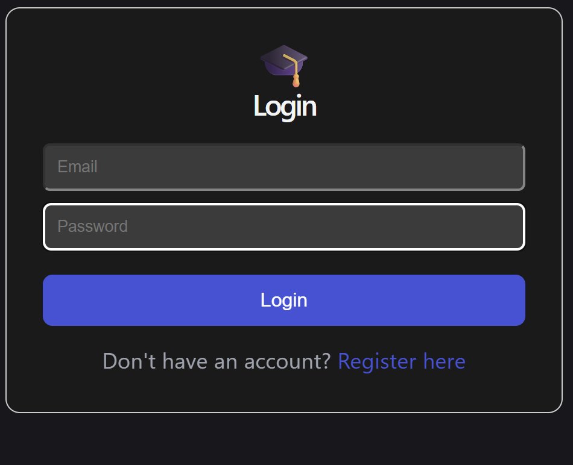 | 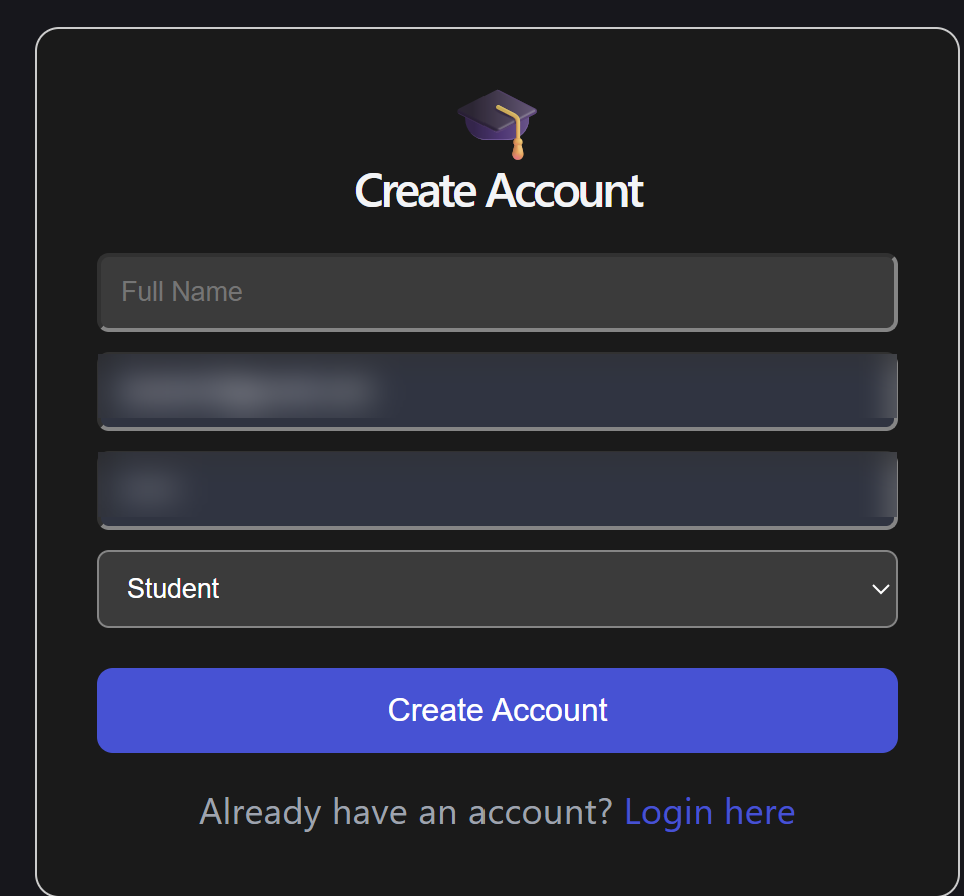 |

### 👑 Admin Panel

| Admin Dashboard | Manage Users |
|---|---|
| 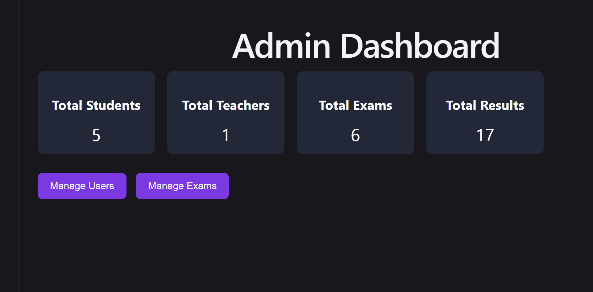 | 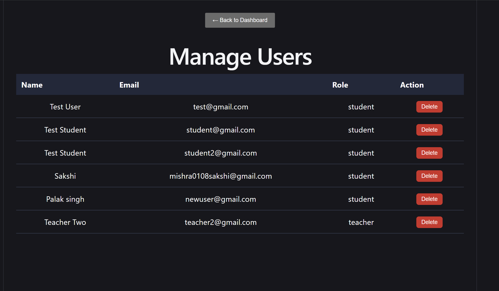 |

| Manage Exams |
|---|
| 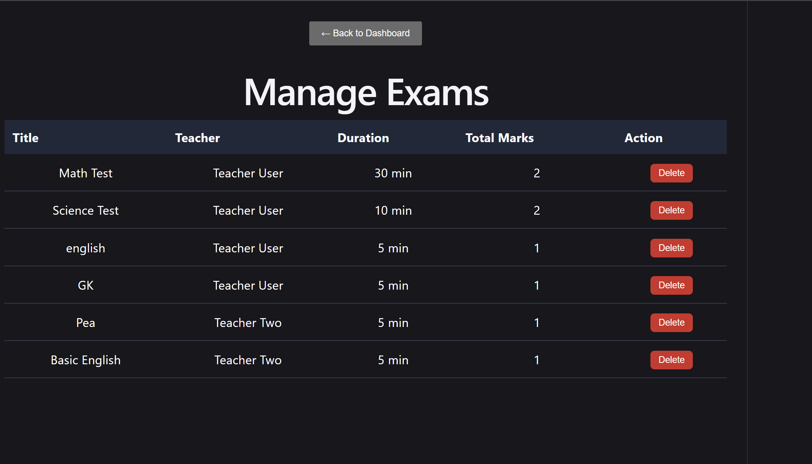 |

### 👨‍🏫 Teacher Panel

| Teacher Dashboard | All Exams |
|---|---|
| 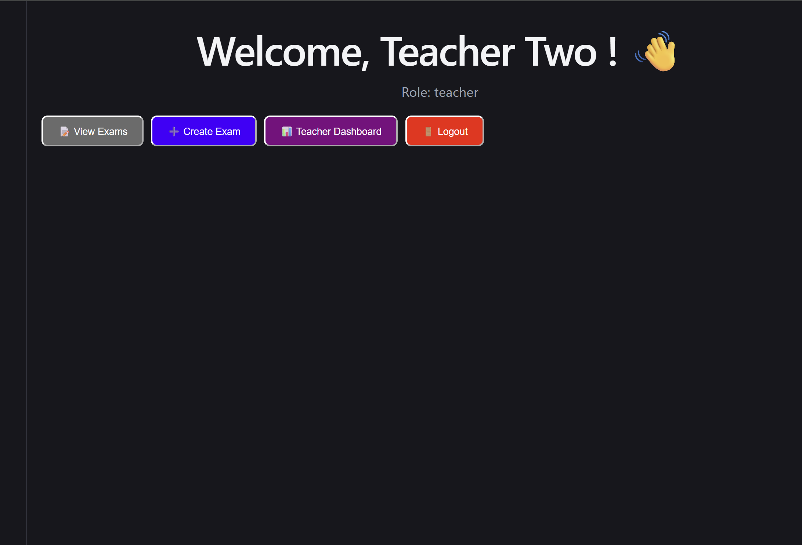 | 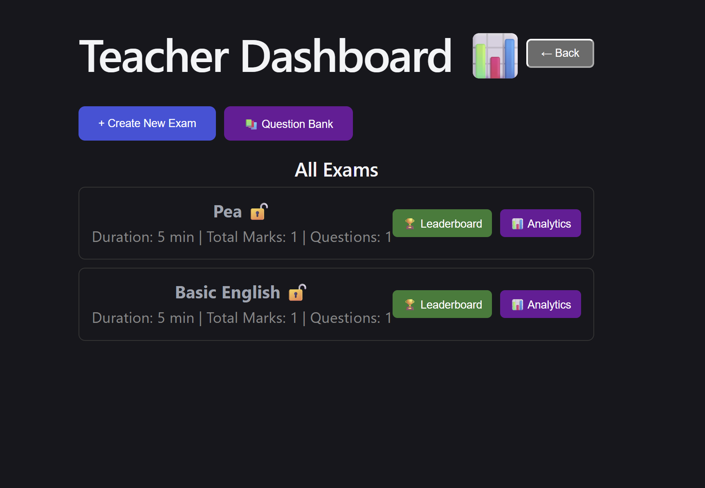 |

### 🎓 Student Panel

| Student Dashboard | Available Exams |
|---|---|
| 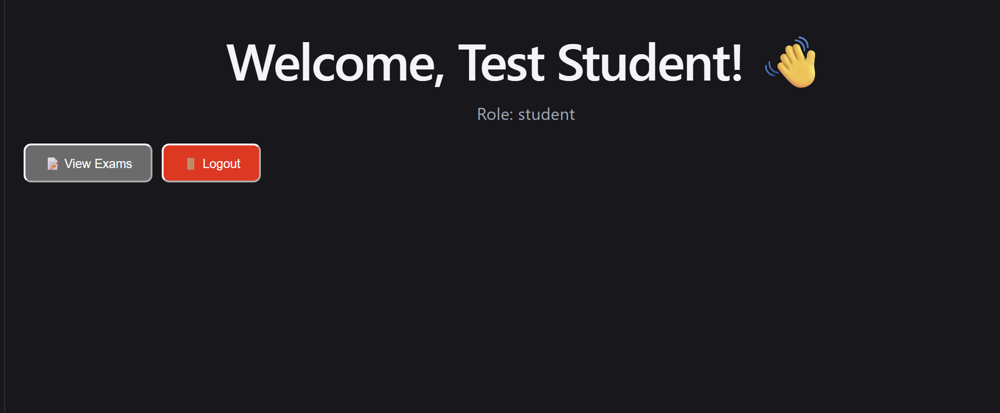 | 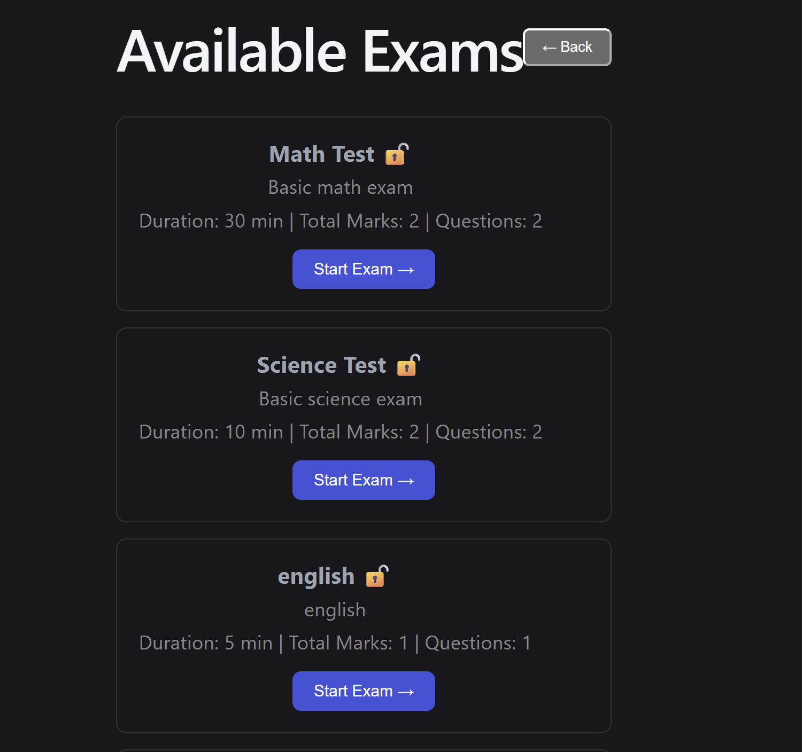 |

### 🛡️ Proctoring in Action

| Live Exam Session (camera feed blurred for privacy) |
|---|
| 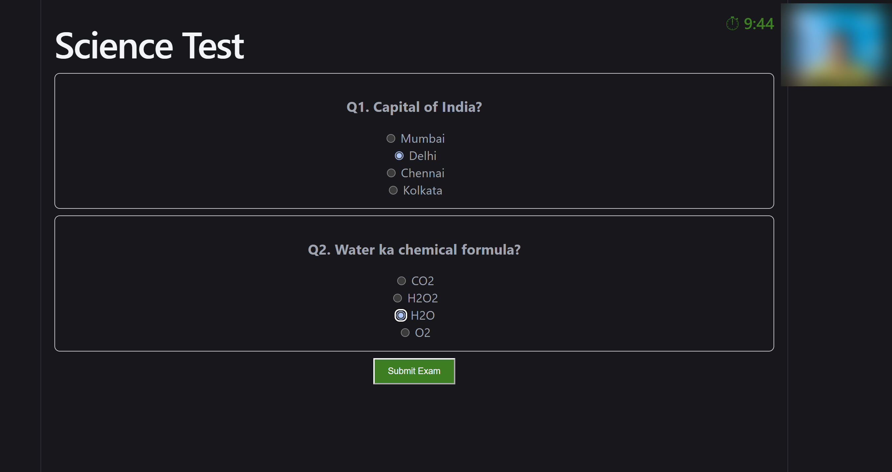 |

| Full-Screen Exit Warning | Leaderboard |
|---|---|
| 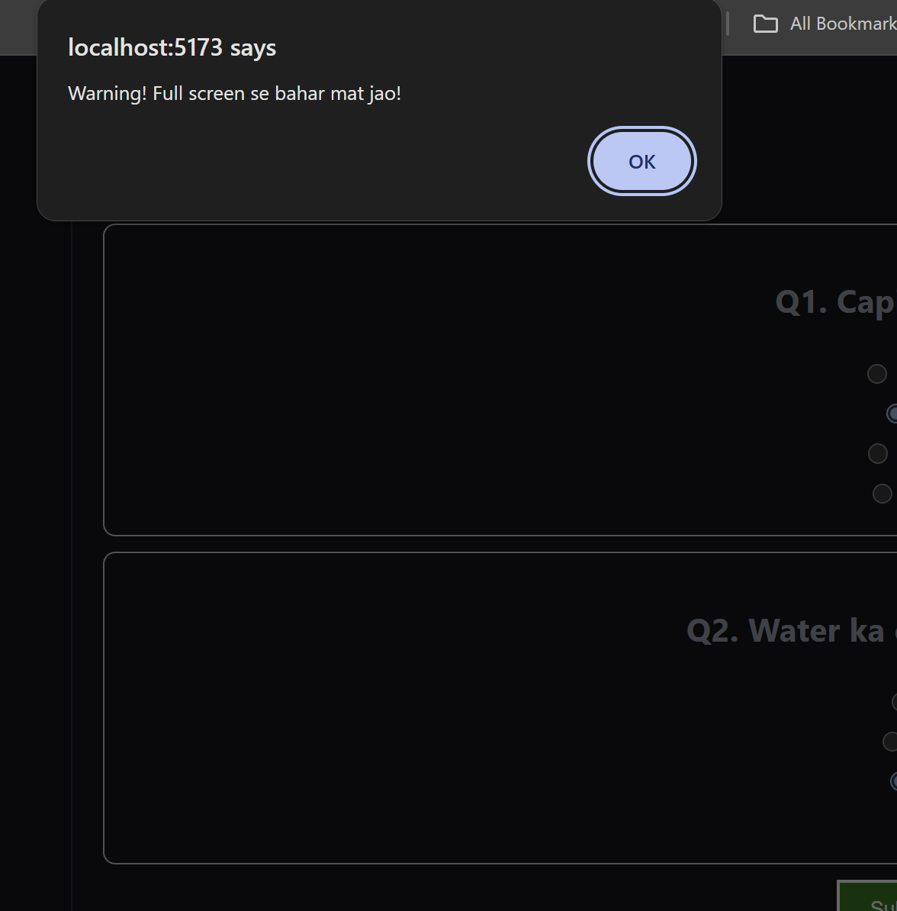 | 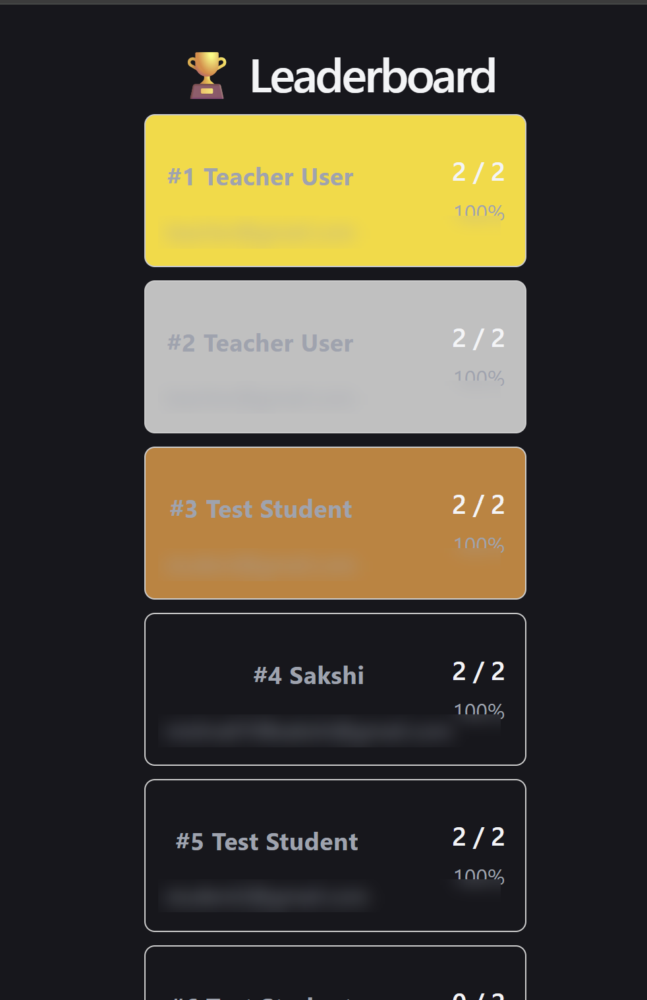 |

---

## 🗺 Roadmap

- [ ] Real-time proctoring feed for teachers (live student activity stream)
- [ ] Per-student question randomization
- [ ] Bulk question import (CSV/Excel)
- [ ] Forgot-password / email-based recovery flow
- [ ] Mobile-responsive layout pass
- [ ] Exportable result reports (PDF/Excel)

---

## 👩‍💻 Author
Sakshi Kumari - Full Stack Developer 

Designed and built independently as a full-stack project to explore secure authentication, role-based access control, and browser-based proctoring mechanics end-to-end.

---

## 📜 License

This project is developed for educational and portfolio purposes.

<div align="center">

**⭐ If you found this project interesting, a star would mean a lot.**

</div>
